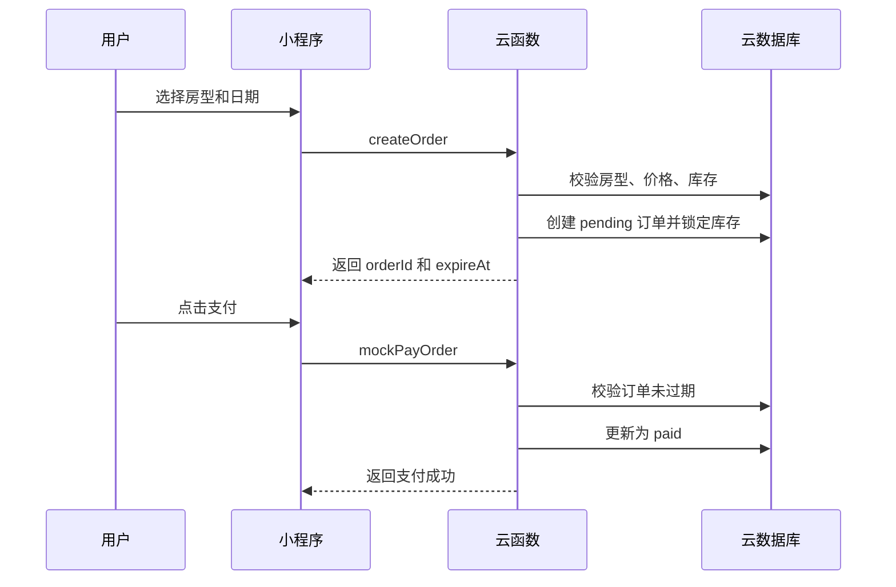
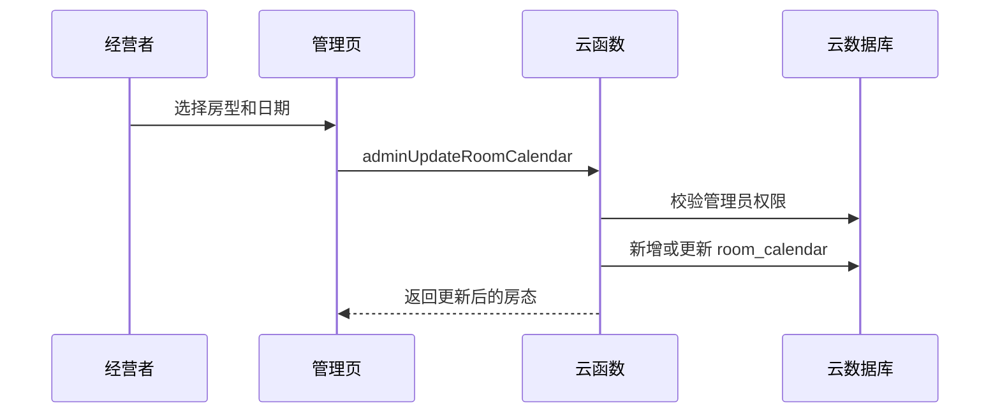

# 云生小楼微信小程序云函数接口设计

本文档只定义后端接口契约，不包含后端代码。后端技术栈按已确认方案使用微信云开发、云数据库和云函数。

## 1. 接口约定

### 1.1 云函数入口

首阶段建议复用一个业务云函数入口，通过 `type` 做接口分发。

```json
{
  "type": "listRooms",
  "payload": {}
}
```

建议云函数名：

| 云函数 | 用途 |
| --- | --- |
| `quickstartFunctions` | 当前项目已存在，可继续承载首阶段接口分发 |

后续接口复杂度提高后，可以再拆分为 `hotelFunctions`、`orderFunctions`、`adminFunctions`。首阶段不建议过早拆分。

### 1.2 通用响应

成功响应：

```json
{
  "success": true,
  "data": {},
  "requestId": "req_20260625_000001"
}
```

失败响应：

```json
{
  "success": false,
  "code": "INVALID_PARAM",
  "message": "入住日期不能为空",
  "requestId": "req_20260625_000001"
}
```

### 1.3 通用规则

| 项目 | 规则 |
| --- | --- |
| 用户身份 | 用户接口从 `cloud.getWXContext()` 获取 `openid`，前端不传 `openid` |
| 管理员身份 | 管理员接口根据 `admin_users` 集合校验当前 `openid` |
| 日期格式 | 入住、离店、房态日期统一使用 `YYYY-MM-DD` |
| 金额单位 | 当前设计文档中使用元，类型为 number |
| 订单超时 | 待支付订单创建后 30 分钟自动取消 |
| 支付方式 | 未配置微信支付商户号前使用模拟支付；正式支付另行接入微信支付 |
| 退款方式 | 用户不能自助退款，由经营者人工处理并记录 |

## 2. 状态枚举

### 2.1 订单状态

| 状态 | 说明 |
| --- | --- |
| `pending` | 待支付 |
| `paid` | 已支付 |
| `cancelled` | 已取消 |
| `completed` | 已完成 |
| `refunded` | 已退款 |

### 2.2 支付状态

| 状态 | 说明 |
| --- | --- |
| `unpaid` | 未支付 |
| `paid` | 已支付 |
| `refunded` | 已退款 |

### 2.3 退款状态

| 状态 | 说明 |
| --- | --- |
| `none` | 无退款 |
| `processing` | 处理中 |
| `processed` | 已处理 |
| `rejected` | 已拒绝 |

## 3. 用户端接口

### 3.1 获取 OpenID

用于确认当前微信用户身份。

请求：

```json
{
  "type": "getOpenId"
}
```

响应：

```json
{
  "success": true,
  "data": {
    "openid": "o_demo_user_001",
    "appid": "wxb9e98ab7d1c66aba",
    "unionid": ""
  }
}
```

### 3.2 获取民宿资料

用于首页、关于页面展示民宿基础信息。

请求：

```json
{
  "type": "getHotelProfile"
}
```

响应：

```json
{
  "success": true,
  "data": {
    "_id": "yunsheng",
    "name": "云生小楼民宿",
    "address": "浙江平阳跷头村58号",
    "city": "浙江平阳",
    "roomCount": 9,
    "phone": "待补充",
    "tags": ["海景", "亲子", "整洁舒适"],
    "facilities": ["无线网络", "停车", "空调", "热水"]
  }
}
```

### 3.3 房型列表

用于房间预览、选择房型。未传日期时返回基础房型；传入日期时返回该日期范围内的最低展示价和可订状态。

请求：

```json
{
  "type": "listRooms",
  "payload": {
    "checkIn": "2026-07-01",
    "checkOut": "2026-07-02",
    "guests": 2
  }
}
```

入参：

| 字段 | 类型 | 必填 | 说明 |
| --- | --- | --- | --- |
| `checkIn` | string | 否 | 入住日期 |
| `checkOut` | string | 否 | 离店日期 |
| `guests` | number | 否 | 入住人数 |

响应：

```json
{
  "success": true,
  "data": {
    "rooms": [
      {
        "_id": "tatami",
        "name": "榻榻米房",
        "cover": "/images/hotel/tatami/tatami-01.jpg",
        "area": "22平",
        "bed": "1张1.51米榻榻米",
        "capacity": 2,
        "basePrice": 234,
        "displayPrice": 234,
        "stock": 2,
        "isBookable": true,
        "tags": ["舒适榻榻米"]
      }
    ]
  }
}
```

业务规则：

| 场景 | 处理 |
| --- | --- |
| 未传日期 | 只返回上架房型基础信息 |
| 已传日期 | 读取 `room_calendar`，没有日历记录时使用 `rooms.basePrice` 和 `rooms.stock` |
| 人数超过容量 | `isBookable` 返回 `false` |
| 任一天不可订或库存不足 | `isBookable` 返回 `false` |

### 3.4 房型详情

用于房型详情页、预订前确认。

请求：

```json
{
  "type": "getRoomDetail",
  "payload": {
    "roomId": "room309",
    "checkIn": "2026-07-01",
    "checkOut": "2026-07-02"
  }
}
```

入参：

| 字段 | 类型 | 必填 | 说明 |
| --- | --- | --- | --- |
| `roomId` | string | 是 | 房型 ID |
| `checkIn` | string | 否 | 入住日期 |
| `checkOut` | string | 否 | 离店日期 |

响应：

```json
{
  "success": true,
  "data": {
    "_id": "room309",
    "name": "Loft亲子海景套房309",
    "area": "58平",
    "bed": "1张大床及1张榻榻米",
    "capacity": 4,
    "basePrice": 622,
    "images": [
      "/images/hotel/loft309/309-01.jpg",
      "/images/hotel/loft309/309-02.jpg"
    ],
    "cancelPolicy": {
      "type": "non_cancelable",
      "text": "预定不可取消"
    },
    "dailyPrices": [
      {
        "date": "2026-07-01",
        "price": 622,
        "remainingStock": 1,
        "isBookable": true
      }
    ],
    "totalAmount": 622
  }
}
```

### 3.5 创建订单

用于提交预订。金额、晚数、库存必须由云函数重新计算，不能信任前端传入价格。

请求：

```json
{
  "type": "createOrder",
  "payload": {
    "roomId": "room309",
    "checkIn": "2026-07-01",
    "checkOut": "2026-07-02",
    "guests": 4,
    "contactName": "张三",
    "phone": "13800000000",
    "remark": "带小孩入住"
  }
}
```

入参：

| 字段 | 类型 | 必填 | 说明 |
| --- | --- | --- | --- |
| `roomId` | string | 是 | 房型 ID |
| `checkIn` | string | 是 | 入住日期 |
| `checkOut` | string | 是 | 离店日期 |
| `guests` | number | 是 | 入住人数 |
| `contactName` | string | 是 | 联系人 |
| `phone` | string | 是 | 手机号 |
| `remark` | string | 否 | 备注 |

响应：

```json
{
  "success": true,
  "data": {
    "orderId": "order_demo_pending_001",
    "status": "pending",
    "amount": 622,
    "nights": 1,
    "expireAt": "2026-07-01T12:30:00.000Z",
    "paymentMode": "mock"
  }
}
```

业务规则：

| 场景 | 处理 |
| --- | --- |
| 离店日期不晚于入住日期 | 返回 `INVALID_PARAM` |
| 入住人数超过房型容量 | 返回 `INVALID_PARAM` |
| 房型不存在 | 返回 `ROOM_NOT_FOUND` |
| 房型已下架 | 返回 `ROOM_INACTIVE` |
| 任一天不可订 | 返回 `DATE_UNAVAILABLE` |
| 任一天库存不足 | 返回 `STOCK_NOT_ENOUGH` |
| 创建成功 | 写入 `orders`，并锁定或扣减对应日期库存 |

实现建议：创建订单和扣减房态库存应放在同一个事务中，避免并发超卖。

### 3.6 订单列表

用于用户查看自己的订单。返回前应先处理当前用户已超时的待支付订单。

请求：

```json
{
  "type": "listOrders",
  "payload": {
    "status": "pending"
  }
}
```

入参：

| 字段 | 类型 | 必填 | 说明 |
| --- | --- | --- | --- |
| `status` | string | 否 | 不传则返回全部订单 |

响应：

```json
{
  "success": true,
  "data": {
    "orders": [
      {
        "_id": "order_demo_pending_001",
        "roomName": "Loft亲子海景套房309",
        "checkIn": "2026-07-01",
        "checkOut": "2026-07-02",
        "nights": 1,
        "amount": 622,
        "status": "pending",
        "paymentStatus": "unpaid",
        "expireAt": "2026-07-01T12:30:00.000Z"
      }
    ]
  }
}
```

### 3.7 订单详情

用于用户查看订单详情。用户只能读取自己的订单。

请求：

```json
{
  "type": "getOrderDetail",
  "payload": {
    "orderId": "order_demo_pending_001"
  }
}
```

响应：

```json
{
  "success": true,
  "data": {
    "_id": "order_demo_pending_001",
    "roomId": "room309",
    "roomName": "Loft亲子海景套房309",
    "checkIn": "2026-07-01",
    "checkOut": "2026-07-02",
    "guests": 4,
    "amount": 622,
    "status": "pending",
    "paymentStatus": "unpaid",
    "contactName": "张三",
    "phone": "13800000000",
    "cancelPolicy": {
      "type": "non_cancelable",
      "text": "预定不可取消"
    }
  }
}
```

### 3.8 模拟支付订单

用于当前未配置微信支付商户号阶段的开发测试。正式接入微信支付后，此接口只能在测试环境保留。

请求：

```json
{
  "type": "mockPayOrder",
  "payload": {
    "orderId": "order_demo_pending_001"
  }
}
```

响应：

```json
{
  "success": true,
  "data": {
    "orderId": "order_demo_pending_001",
    "status": "paid",
    "paymentStatus": "paid",
    "paidAt": "2026-07-01T12:05:00.000Z"
  }
}
```

业务规则：

| 场景 | 处理 |
| --- | --- |
| 订单不存在 | 返回 `ORDER_NOT_FOUND` |
| 订单不属于当前用户 | 返回 `ORDER_NOT_OWNED` |
| 订单已超时 | 自动取消并返回 `ORDER_EXPIRED` |
| 订单不是待支付 | 返回 `ORDER_STATUS_INVALID` |
| 支付成功 | 更新订单为 `paid` |

### 3.9 取消待支付订单

用于用户取消未支付订单。已支付订单退款由经营者人工处理，不走用户自助取消。

请求：

```json
{
  "type": "cancelOrder",
  "payload": {
    "orderId": "order_demo_pending_001"
  }
}
```

响应：

```json
{
  "success": true,
  "data": {
    "orderId": "order_demo_pending_001",
    "status": "cancelled",
    "cancelledAt": "2026-07-01T12:10:00.000Z"
  }
}
```

业务规则：

| 场景 | 处理 |
| --- | --- |
| 订单不存在 | 返回 `ORDER_NOT_FOUND` |
| 订单不属于当前用户 | 返回 `ORDER_NOT_OWNED` |
| 订单不是待支付 | 返回 `ORDER_STATUS_INVALID` |
| 取消成功 | 更新订单并释放对应日期库存 |

## 4. 经营者后台接口

后台接口均需要校验当前 `openid` 是否存在于 `admin_users` 且 `isActive=true`。

### 4.1 后台订单列表

请求：

```json
{
  "type": "adminListOrders",
  "payload": {
    "status": "paid",
    "dateFrom": "2026-07-01",
    "dateTo": "2026-07-31",
    "roomId": "room309"
  }
}
```

响应：

```json
{
  "success": true,
  "data": {
    "orders": [
      {
        "_id": "order_demo_paid_001",
        "roomName": "Loft海景大床套房310",
        "checkIn": "2026-07-03",
        "checkOut": "2026-07-04",
        "guests": 2,
        "amount": 556,
        "status": "paid",
        "contactName": "李四",
        "phone": "13900000000"
      }
    ]
  }
}
```

### 4.2 后台订单详情

请求：

```json
{
  "type": "adminGetOrderDetail",
  "payload": {
    "orderId": "order_demo_paid_001"
  }
}
```

响应字段与用户端 `getOrderDetail` 基本一致，但不限制订单归属。

### 4.3 查询房态日历

用于后台展示某段日期的价格、库存和可订状态。

请求：

```json
{
  "type": "adminListRoomCalendar",
  "payload": {
    "roomId": "room309",
    "dateFrom": "2026-10-01",
    "dateTo": "2026-10-07"
  }
}
```

响应：

```json
{
  "success": true,
  "data": {
    "items": [
      {
        "_id": "room309_2026-10-01",
        "roomId": "room309",
        "date": "2026-10-01",
        "price": 888,
        "stock": 1,
        "remainingStock": 1,
        "isBookable": true,
        "priceType": "holiday",
        "note": "国庆测试价"
      }
    ]
  }
}
```

### 4.4 更新单日房态

用于卖家维护节假日价格、库存和是否可订。

请求：

```json
{
  "type": "adminUpdateRoomCalendar",
  "payload": {
    "roomId": "room309",
    "date": "2026-10-01",
    "price": 888,
    "stock": 1,
    "remainingStock": 1,
    "isBookable": true,
    "priceType": "holiday",
    "note": "国庆价格"
  }
}
```

响应：

```json
{
  "success": true,
  "data": {
    "_id": "room309_2026-10-01",
    "roomId": "room309",
    "date": "2026-10-01",
    "price": 888,
    "stock": 1,
    "remainingStock": 1,
    "isBookable": true,
    "priceType": "holiday"
  }
}
```

业务规则：

| 场景 | 处理 |
| --- | --- |
| 房型不存在 | 返回 `ROOM_NOT_FOUND` |
| 价格小于 0 | 返回 `INVALID_PARAM` |
| 库存小于 0 | 返回 `INVALID_PARAM` |
| `remainingStock` 大于 `stock` | 返回 `INVALID_PARAM` |
| 当天已有记录 | 更新原记录 |
| 当天无记录 | 新增记录 |

### 4.5 批量更新房态

用于后台批量维护节假日或连续日期价格。

请求：

```json
{
  "type": "adminBatchUpdateRoomCalendar",
  "payload": {
    "items": [
      {
        "roomId": "room309",
        "date": "2026-10-01",
        "price": 888,
        "stock": 1,
        "remainingStock": 1,
        "isBookable": true,
        "priceType": "holiday",
        "note": "国庆价格"
      },
      {
        "roomId": "room309",
        "date": "2026-10-02",
        "price": 888,
        "stock": 1,
        "remainingStock": 1,
        "isBookable": true,
        "priceType": "holiday",
        "note": "国庆价格"
      }
    ]
  }
}
```

响应：

```json
{
  "success": true,
  "data": {
    "updated": 2,
    "failed": []
  }
}
```

### 4.6 记录人工退款

用于经营者人工处理退款。首阶段只记录处理结果，不触发微信支付退款。

请求：

```json
{
  "type": "adminRecordRefund",
  "payload": {
    "orderId": "order_demo_paid_001",
    "amount": 556,
    "status": "processed",
    "reason": "客人临时取消",
    "note": "已线下处理"
  }
}
```

响应：

```json
{
  "success": true,
  "data": {
    "refundId": "refund_demo_001",
    "orderId": "order_demo_paid_001",
    "amount": 556,
    "status": "processed"
  }
}
```

业务规则：

| 场景 | 处理 |
| --- | --- |
| 订单不存在 | 返回 `ORDER_NOT_FOUND` |
| 订单未支付 | 返回 `ORDER_STATUS_INVALID` |
| 退款金额大于订单金额 | 返回 `INVALID_PARAM` |
| `status=processed` | 写入退款记录，订单更新为 `refunded`，支付状态更新为 `refunded` |
| `status=rejected` | 写入退款记录，订单保持原状态 |

## 5. 错误码

| 错误码 | 说明 |
| --- | --- |
| `UNAUTHORIZED` | 未获取到登录身份 |
| `FORBIDDEN` | 当前用户无后台权限 |
| `INVALID_PARAM` | 参数错误 |
| `ROOM_NOT_FOUND` | 房型不存在 |
| `ROOM_INACTIVE` | 房型已下架 |
| `DATE_UNAVAILABLE` | 日期不可订 |
| `STOCK_NOT_ENOUGH` | 库存不足 |
| `ORDER_NOT_FOUND` | 订单不存在 |
| `ORDER_NOT_OWNED` | 订单不属于当前用户 |
| `ORDER_EXPIRED` | 订单已超时 |
| `ORDER_STATUS_INVALID` | 订单状态不允许当前操作 |
| `PAYMENT_NOT_CONFIGURED` | 微信支付未配置 |
| `SERVER_ERROR` | 服务端异常 |

## 6. 关键业务流程

### 6.1 创建订单和模拟支付



### 6.2 待支付订单超时取消

触发点：

| 触发点 | 说明 |
| --- | --- |
| `listOrders` | 用户进入订单列表时处理自己的超时订单 |
| `getOrderDetail` | 用户进入订单详情时处理当前订单 |
| `mockPayOrder` | 支付前再次校验是否过期 |
| 定时触发器 | 后续可增加云函数定时器，统一清理所有超时订单 |

处理结果：

1. 订单状态从 `pending` 更新为 `cancelled`。
2. 释放该订单占用的 `room_calendar.remainingStock`。
3. 写入 `cancelledAt` 和 `cancelReason=timeout`。

### 6.3 后台维护节假日价格



## 7. 测试场景

| 编号 | 场景 | 期望结果 |
| --- | --- | --- |
| T01 | 不传日期调用 `listRooms` | 返回 6 个上架房型 |
| T02 | 预订 `room309`，2026-07-01 到 2026-07-02，4 人 | 创建待支付订单，金额 622 |
| T03 | 预订 `tatami`，入住人数 3 人 | 返回 `INVALID_PARAM` |
| T04 | 某房型某日 `remainingStock=0` 后继续下单 | 返回 `STOCK_NOT_ENOUGH` |
| T05 | 待支付订单超过 30 分钟后支付 | 返回 `ORDER_EXPIRED`，订单变为已取消 |
| T06 | 用户读取其他人的订单 | 返回 `ORDER_NOT_OWNED` |
| T07 | 非管理员调用后台接口 | 返回 `FORBIDDEN` |
| T08 | 管理员把 `room309` 国庆价格改为 888 | 后续查询该日期展示价为 888 |
| T09 | 管理员处理已支付订单退款 | 新增退款记录，订单更新为 `refunded` |

## 8. 后续接入微信支付时的接口变化

当前由于微信支付商户号暂未配置，接口设计保留 `mockPayOrder` 作为开发测试能力。正式接入微信支付后建议新增：

| 接口 | 说明 |
| --- | --- |
| `createPayment` | 根据待支付订单创建微信支付参数 |
| `handlePayNotify` | 接收微信支付回调，更新订单支付状态 |
| `adminWechatRefund` | 后台发起微信支付退款，当前阶段先不做 |

正式支付接入后，订单金额应在支付接口中转换为分，并以云函数计算结果为准。
